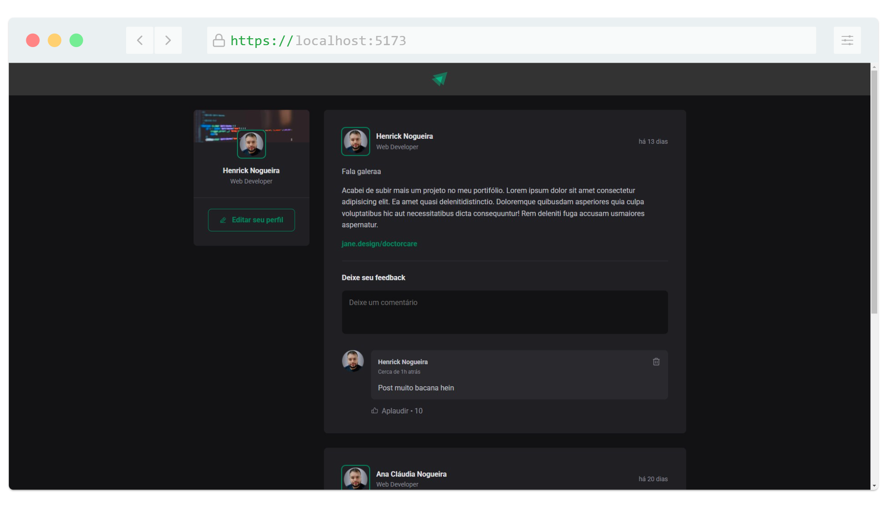

<h1 align="center">
   
</h1>

<h4 align="center"> 
	🚧 IGNITE 🚀 Concluido...  🚧
</h4>

## ✅ Funções

- <h3>POSTS</h3>

  - [x] CRIAR NOVO POST
  - [x] CRIAR COMENTÁRIO
  - [x] APAGAR COMENTÁRIO
  - [x] APLAUDIR COMENTÁRIO

## 📚 Descrição

📣 Meu Primeiro Projeto em React Após Muito Tempo! 🚀
Depois de muito tempo desde meu último contato com React.js em 2019, finalmente decidi me dedicar novamente a essa poderosa biblioteca de front-end. Estava postergando esse estudo há bastante tempo, mas agora React.js está oficialmente na minha lista de metas de desenvolvimento pessoal — e estou muito feliz com os resultados até agora! 🎯

Meu primeiro projeto nessa nova jornada foi o Ignite, uma aplicação voltada para publicação de posts e interação com comentários. Aqui estão algumas funcionalidades que implementei:

✅ Publicação de posts.
✅ Adição de comentários em posts.
✅ Curtir comentários.
✅ Remoção de comentários.

Foi um desafio retomar o aprendizado, mas cada linha de código me trouxe um novo aprendizado e reforçou o quanto o React é incrível para criar interfaces dinâmicas e interativas.

Este é só o começo, e estou ansioso para construir ainda mais projetos e compartilhar essa jornada de crescimento! 🌟

Se você também está explorando ou já domina React, compartilhe suas dicas e experiências nos comentários. Vou adorar aprender com você! 😊

#ReactJS #DesenvolvimentoWeb #Programação #AprendizadoConstante #Projetos

## 🛠 Tecnologias

As seguintes ferramentas foram usadas na construção do projeto:

- [React](https://vuejs.org/)
- [HTML5](https://www.w3schools.com/html/default.asp)
-  [CSS 3](https://www.w3schools.com/css/)
-  [JavaScript](https://developer.mozilla.org/pt-BR/docs/Web/JavaScript)

## 📱 Plataforma adotada

- Web;

## 📸 Screenshot

	

